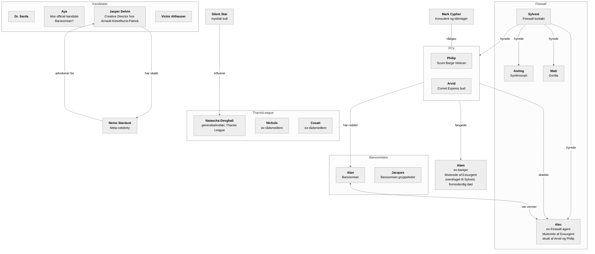

### Philip og Arvids eventyr - HabFab & Grobund

```mermaid
%%{init: {'theme': 'neutral', 'themeVariables': {'darkMode': false}, "flowchart" : { "curve" : "basis" } } }%%
flowchart TB
subgraph PCs
Philip[<B>Philip</B><BR />Scum Barge Veteran];
Arvid[<B>Arvid</B><BR />Comet Express bud];
end
subgraph Barsoomians
Alan[<B>Alan</B><BR />Barsoomian];
Jacques[<B>Jacques</B><BR />Barsoomian gruppeleder];
end
subgraph Firewall
Alec[<B>Alec</B><BR />ex-Firewall agent<BR />Muterede af Exsurgent<BR />skudt af Arvid og Philip]
Sylvest[<B>Sylvest</B><BR />Firewall kontakt]
Matt[<B>Matt</B><BR />Gorilla]
Aisling[<B>Aisling</B><BR />Synthmorph]
end
subgraph Kandidater
Sarda[<B>Dr. Sarda</B><BR />]
Aya[<B>Aya</B><BR />ikke officiel kandidat<BR />Barsoomian?]
Delvin[<B>Jasper Delvin</B><BR />Creative Director hos Arnault-Kieselhurst-Patrick]
Althauser[<B>Victor Althauser</B><BR />]
end
subgraph TharsisLeague
Devghali[<B>Natascha Devghali</B><BR />generalsekretær, Tharsis League]
Nichols[<B>Nichols</B><BR />ex-rådsmedlem]
Cosati[<B>Cosati</B><BR />ex-rådsmedlem]
end
SilentStar[<B>Silent Star</B><BR />mystisk kult]
Cypher[<B>Mark Cypher</B><BR />Konsulent og idémager]
Nemo[<B>Nemo Stardust</B><BR />Meta-celebrity]
Alam[<B>Alam</B><BR />ex-barejer<BR />Muterede af Exsurgent<BR />overdraget til Sylvest, formodentlig død]
Sylvest -->|hyrede| Alec
Sylvest -->|hyrede| PCs
Sylvest -->|hyrede| Matt
Sylvest -->|hyrede| Aisling
Alan <---> |var venner| Alec
PCs --->|dræbte| Alec
PCs --->|fangede| Alam
PCs --->|har reddet| Alan
Delvin --->|har skabt| Nemo
Nemo --->|advokerer for| Delvin
SilentStar --->|influerer|Devghali
Cypher --- |rådgav|PCs
```
